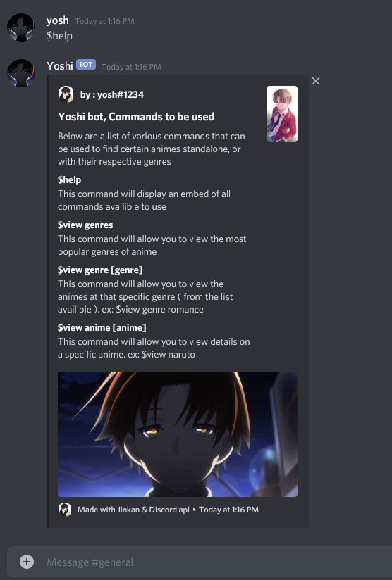
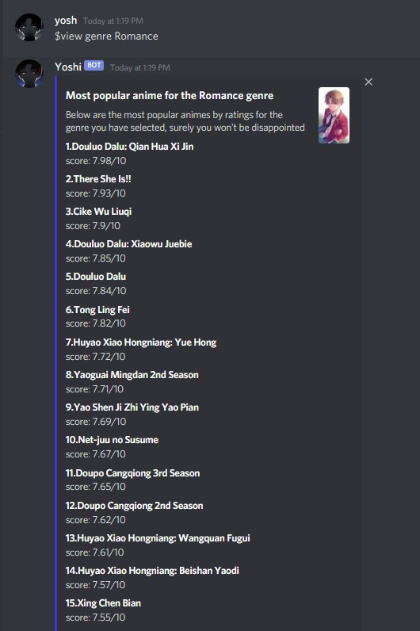
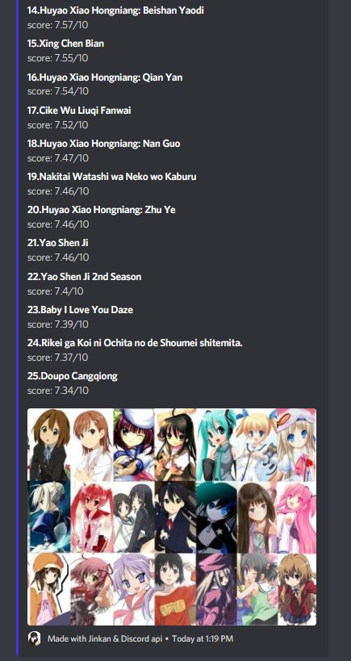
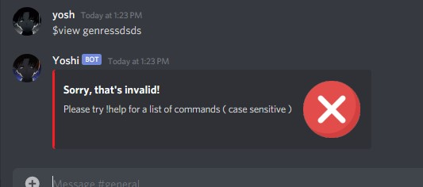

version 1.0.0

# Purpose

This discord bot is intended to provide the users with an experience that many anime bots lack, which includes
features like : acessing a database for anime queries and listing different animes for a certain genre. This bot is
originally designed for smaller use, but is being prepared for commerical use.

# Implemented Technologies

Written in Javascript, with Node.js ( However not constant runtime ). Jikan API is used to
access the anime database & myanimelist. Discord.js is used for
implementation of the discord client for user commands which utilizes the Node.js Version 12.16

# Features and usage of the bot

### Getting a list of commands

The $ is the prefix for any user typed command, below is the $help command
which will give a list of commands that the user can use with a brief description of them.

### Viewing all genres

The \$view genres command is used for looking at the most popular anime genres
( from myanimelist, sorted with ratings and viewership )

## Viewing specific anime at that genre

The \$view genre (type-genre) will list the top 25 anime at that specific genre
( Sorted by ratings )

## Invalid commands

Any invalid commands are filtered with a discord embed, accounting for edge
cases, or api error

